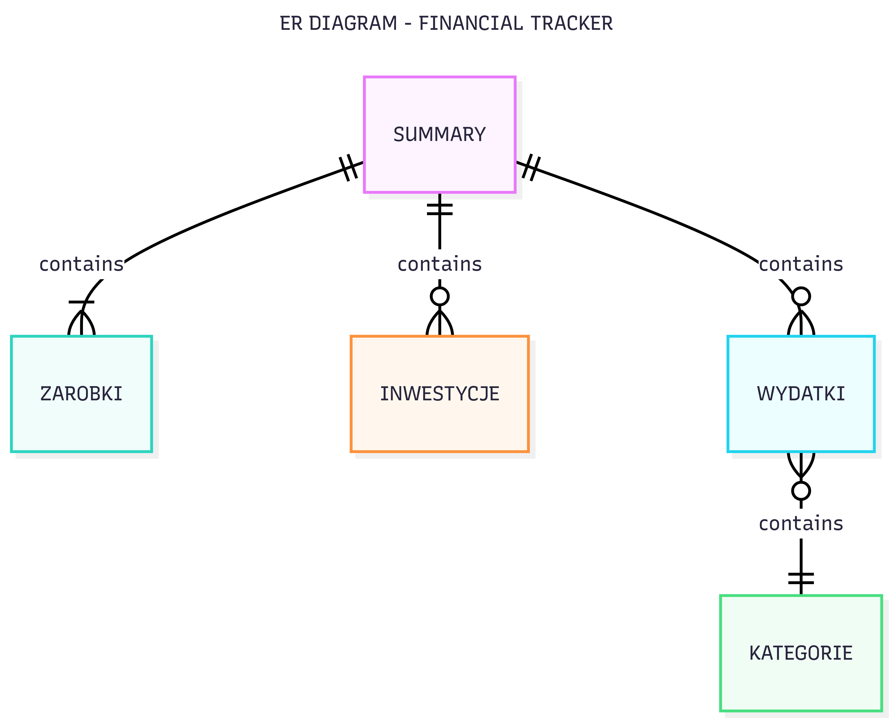

# SQL PROJECT - PERSONAL FINANCIAL TRACKER

### Authors: Iga Łakoma & Pedro Chaves

### Video demo:

### License
This project is open-source. Feel free to modify and use it for educational purposes.

## Purpose
The goal of this project is to create a database using SQLite3 that stores data about monthly incomes, expenses and investments, in order to track their finances, monitor financial health and do a possible study about prices throughout time. The system is designed for personal use, but could easily be adapted to accommodate multiple users or larger financial datasets.

## Scope

Since the authors live in Poland, the project has data written in the Polish language and the currency that was used was the Polish Złoty (PLN).

This project enables users to:

- Store monthly earnings (`zarobki`)
- Input itemized expenses (`wydatki`) and group them by category
- Track investments (`inwestycje`) with values and timestamps
- Calculate monthly and yearly summaries (sums, averages, ratios)
- Compare income vs. expenses and investments over time
- Create views for easier data access and visualization

The interface is SQL-based, designed for users with some knowledge of SQL commands and relational data operations.

## ER Diagram

## Entities

### 1. `zarobki` (Earnings)
Stores monthly income. Each row represents the income for a given month of a year.

**Columns**:
- `miesiac` (INTEGER): Month (1–12)
- `rok` (INTEGER): Year (e.g., 2024)
- `zarobki` (REAL): Earnings in PLN

### 2. `wydatki` (Expenses)
Stores detailed records of expenses. Each purchase is recorded separately.

**Columns**:
- `data` (TEXT): Purchase date in `DD.MM.YYYY` format
- `produkt` (TEXT): Name of product
- `cena` (REAL): Price in PLN
- `rabat` (REAL): Discount value in PLN
- `kategoria_id` (INTEGER): Foreign key to `kategorie.id`

### 3. `kategorie` (Categories)
Stores expense categories (e.g., "Dom", "Jedzenie").

**Columns**:
- `id` (INTEGER PRIMARY KEY)
- `kategoria` (TEXT): Category name

### 4. `inwestycje` (Investments)
Tracks financial investments. Each record includes an amount, the type of investment and a date.

**Columns**:
- `data` (TEXT): Date in `DD.MM.YYYY` format
- `aktywa` (TEXT): Type of investment
- `ilosc` (REAL): Amount of purchased asset
- `wartosc (za jednostke, PLN)`: Price per unit
- `wartosc calkowita (PLN)` (REAL): Total investment value

## Relationships

- `wydatki.kategoria_id` is a foreign key linking to `kategorie.id`
- All three main tables (`zarobki`, `wydatki`, `inwestycje`) can be joined by year and month, which are extracted from the date columns.

This enables aggregated joins like total income, total expenses, and total investments for a given month.

## Functional Views and Queries

### Monthly Aggregates

- `wydatki_suma_miesieczna`: View that groups and sums expenses per month/year
- Investment and earning aggregates use `substr()` to extract month and year

### Ratios and Comparison

- Monthly activity: `summary`

    A combined query joins all three tables (`zarobki`, `wydatki`, `inwestycje`) by year and month to show a financial overview of all transactions.

- Ratios: `wydatki_vs_zarobki`, `inwestycje_vs_zarobki`

    Views that allow a more direct visualization, percentage wise, of how much was spent (either in expenses/investments)

## Design Decisions

- **No NULL months**: Income (`zarobki`) is assumed to be present each month. Since expenses and investments may be `NULL` values, it was used `LEFT JOIN` and `IFNULL()` to keep all months present in the table.

- **Financial formatting**: Since this is a financial related project, it's common to use the format of 2 decimal places as default for currency data, therefore `printf('%.2f', ...)` was used.

- **Data separation**: Although `zarobki`, `wydatki`, and `inwestycje` are logically linked, they are kept them in separate tables for easier access.

## Optimizations

- Indexed `kategorie.id` (as PRIMARY KEY) for fast lookups during joins
- Grouping done by `rok, miesiac` pairs to minimize repetitive data parsing

## Limitations

- **Single-user scope**: No `user_id` field is included; the system assumes all data belongs to one person. Expanding to multi-user support would require normalization with user tables and foreign keys.

- **Limited categorization**: `inwestycje` and `zarobki` are not categorized, while `wydatki` are. Further improvements could include categorizing investments (e.g., stocks, crypto) or income (e.g., salary, part-time job).

## Potential Improvements

- Add `CHECK` constraints or triggers to validate date format (`DD.MM.YYYY`)
- Use external visualization tools (e.g., Python with matplotlib) for monthly charts
- Expand `zarobki` and `inwestycje` with categories
- Include triggers for asset purchasing/selling logs (include a table, e.g. `portfolio` that updates automatically when an asset is bought/sold)

## Summary

This SQLite project offers a compact personal finance tracking tool that allows for detailed monthly and yearly analysis of income, spending, and investments. It makes full use of SQL for data extraction and aggregation and includes queries for basic financial analysis. With well-designed schema separation and clear formatting, it serves as an excellent tool for anyone looking to gain insight into their financial behavior.
